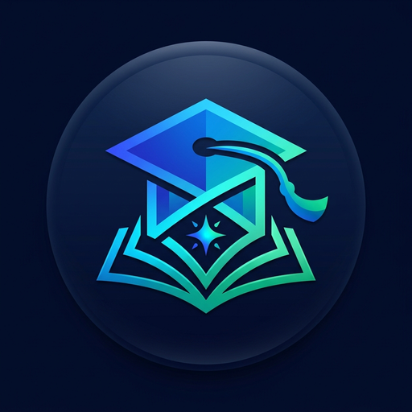

<div align="center">
  
  <h1>🎓 Coaching Management</h1>
  <p><strong>Offline-First Tuition, Academy & Coaching Institute Management System</strong></p>
  <p>Built with React, Vite, Capacitor & Native Android</p>
</div>

---

## 🌟 Key Features

- 📱 **100% Offline & Private**: Zero cloud dependency. All student data, attendance logs, and financial records stay secure on your device.
- 👥 **Student Directory & Digital ID Cards**: Manage student profiles, roll numbers, fee structures, parent WhatsApp contacts, and generate printable digital student ID cards.
- 📅 **Smart Attendance Register**: 1-tap marking (`Present`, `Absent`, `Late`), daily logs, monthly register grids, and **Instant Excel (`.csv`) Export with Native Android Share**.
- 💳 **Fee Collection & Digital Receipts**: Live student lookup, quick fee amount chips, payment mode presets (`⚡ UPI`, `💵 Cash`, `🏦 Bank`, `📝 Cheque`), and printable/shareable payment receipts.
- 🏫 **Class Batches & Revenue Analytics**: Batch scheduling, subject tagging, enrolled student counters, and potential monthly revenue calculations.
- 👨‍🏫 **Faculty & Staff Directory**: Manage teachers, staff roles, monthly salaries, and direct 1-tap WhatsApp communication.
- 🎯 **Admissions CRM Pipeline**: Track inquiries across stages (`New Lead`, `In Follow-up`, `Enrolled`), with pre-filled WhatsApp lead outreach and 1-tap enrollment.
- 💾 **Encrypted Offline Backup & Restore**: 1-tap JSON database export and instant restore across devices.
- 🎬 **Modern Mobile Experience**: Built-in splash intro animation, first-time onboarding wizard, and midnight dark theme with safe-area padding for Android devices.

---

## 📱 Tech Stack

- **Frontend**: React 19, Vite, Lucide Icons, Canvas Confetti
- **Mobile Engine**: Capacitor 7 (Android Native)
- **Design System**: Vanilla CSS Variables, Midnight Slate Dark Theme (`#090d16`)
- **Storage**: Offline-First LocalStore Database with JSON Portability

---

## 🚀 Getting Started

### Prerequisites
- Node.js (v18+)
- Java JDK 21
- Android Studio / Android SDK (for Android APK builds)

### Installation
```bash
# 1. Clone the repository
git clone https://github.com/bhara5t/coaching-management.git
cd coaching-management

# 2. Install dependencies
npm install

# 3. Start local development server
npm run dev
```

---

## 📦 Building the Android APK

```bash
# 1. Build the web bundle
npm run build

# 2. Sync web assets into Android Capacitor project
npx cap sync

# 3. Build optimized debug APK (R8 & resource shrinking enabled)
cd android
./gradlew assembleDebug
```
The compiled APK will be generated at:
`android/app/build/outputs/apk/debug/app-debug.apk`

---

## 📄 License
This project is open source and available under the [MIT License](LICENSE).
