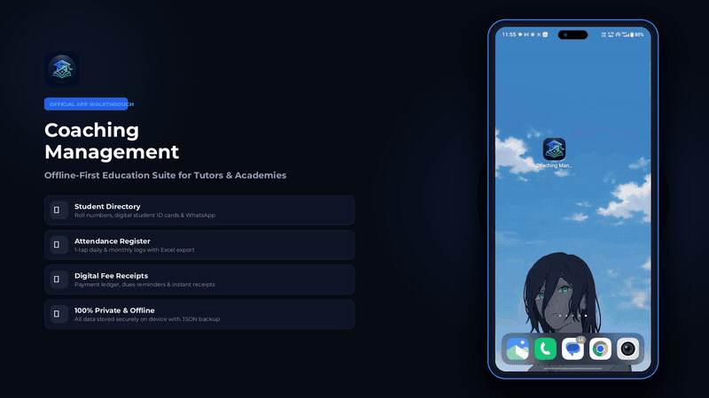

<div align="center">
  
  
  # Coaching Management
  
  **A fast, offline-first operating system for tuition centers, coaching academies & tutors.**

  [-success?style=flat-square&logo=android&logoColor=white)](https://github.com/bhara5t/Coaching-Management/releases)
  [](https://github.com/bhara5t/Coaching-Management)
  [](https://github.com/bhara5t/Coaching-Management)
  [](https://github.com/bhara5t/Coaching-Management)
  [](LICENSE)

</div>

---

<div align="center">
  <a href="docs/assets/Coaching_Management_Tutorial_Landscape.mp4">
    
  </a>
  <p><sub><em>Click preview to watch the full 1080p walkthrough with audio</em></sub></p>
</div>

---

### ✨ Core Capabilities

- 👥 **Student Directory & Digital ID Cards** — Store student profiles, parent contacts, monthly fees, and generate printable student ID cards.
- 📊 **Smart Attendance Register** — 1-tap marking (`Present`, `Absent`, `Late`) with instant monthly Excel (`.csv`) export and native sharing.
- 💳 **Fee Collection & Instant Receipts** — Payment ledger with quick presets (`UPI`, `Cash`, `Bank`), dues reminders & printable digital receipts.
- 🏫 **Class Batches & Revenue** — Track batch timings, student counts, subject distribution, and monthly revenue.
- 🎯 **Admissions CRM Pipeline** — Manage inquiries across stages (`New`, `Follow-up`, `Enrolled`) with 1-tap WhatsApp lead outreach.
- 🔒 **100% Private & Offline** — Zero cloud servers or tracking. Full JSON backup export and 1-tap restore.

---

### 🚀 Quick Start

```bash
# Clone & install
git clone https://github.com/bhara5t/Coaching-Management.git
cd Coaching-Management
npm install

# Run locally in browser
npm run dev
```

---

### 📥 Download Android App

Pre-built ready-to-install Android APKs (`2.2 MB`) are available under the [**Releases**](https://github.com/bhara5t/Coaching-Management/releases) tab.

---

### 📦 Build From Source

```bash
# 1. Build and sync web bundle
npm run build && npx cap sync

# 2. Compile APK
cd android && ./gradlew assembleDebug
```

---

<div align="center">
  <sub>Built with ❤️ for educators & coaching institutes.</sub>
</div>
